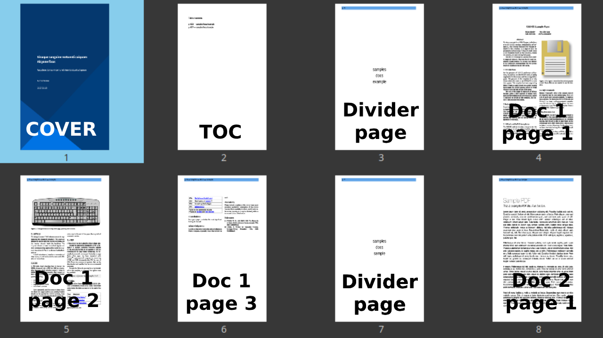
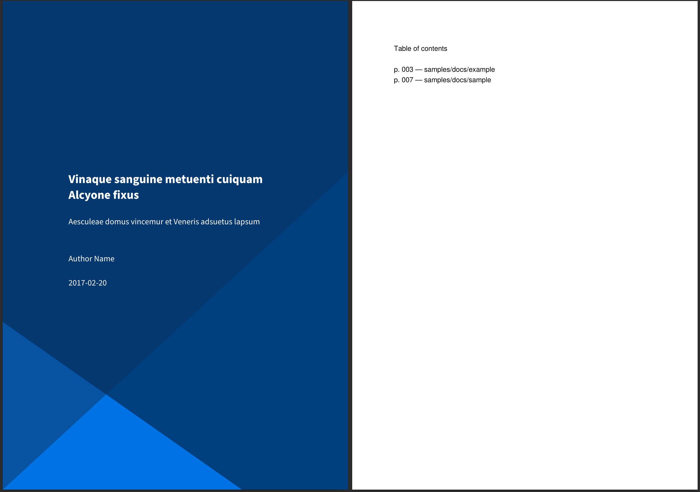
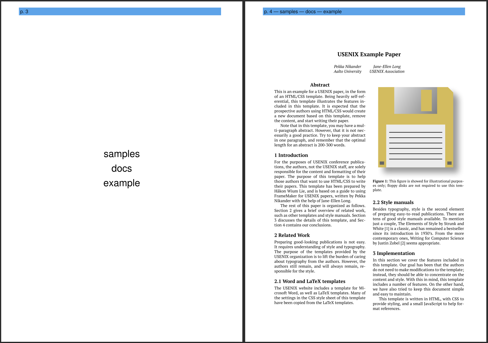

# collatepdf

A simple Python script to **collate multiple PDFs into a single PDF**, with:

* automatic TOC generation with global page numbering
* automatic page resizing to ensure all pages in the collated PDF have the same dimensions
* add an overlay bar on each page with the current file name and global page number

**Note:** this is a quick-and-dirty, alpha-quality script I wrote for my own needs. Use at your own risks. Please feel free to improve it if you find it useful.

## Structure of the collated PDF

- Optional cover PDF
- Table of contents
- Optional divider pages
- PDF documents



## Cover and table of contents



## Optional divider page and first document page with overlay bar



## Installation

Dependencies:

- Python
- pypdf
- reportlab

Installation instructions:

```bash
git clone https://github.com/rossant/collatepdf.git
cd collatepdf/
pip install -e .
```

## Usage

There are two steps:

- Generate an `index.txt` page from your list of PDF documents to collate, and edit it manually to specify the optional divider pages.
- Generate the collated PDF.

```bash
# Create the index file.
collatepdf makeindex samples/docs/*.pdf -o samples/index.txt

# Optionally: manually edit samples/index.txt

# Generate the collated PDF with a cover PDF.
collatepdf makepdf samples/index.txt -c samples/cover.pdf -o samples/collated.pdf
```
